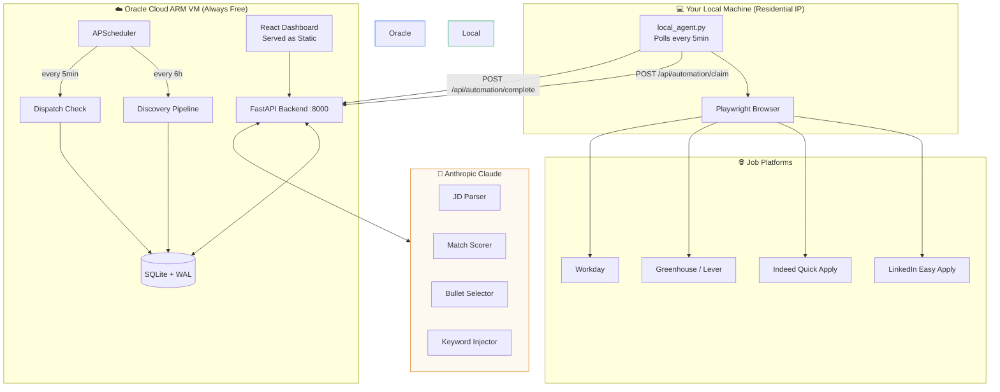
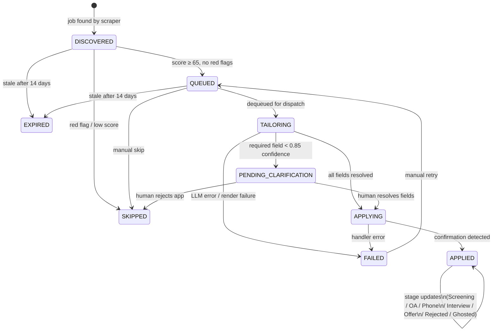
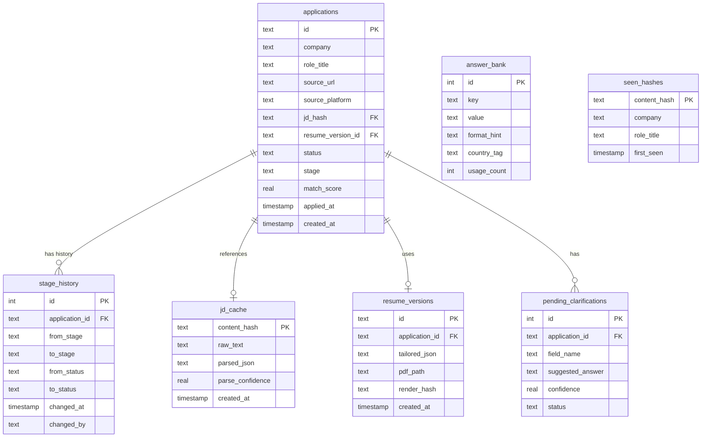
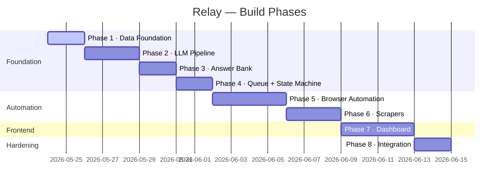

# Relay 🛰️

> Your always-on job application relay station. Discovers jobs, tailors your resume (zero fabrication), handles form submission, and tracks every application through its lifecycle.

[](plan/) [](plan/) [](plan/) [](plan/) [](plan/) [](plan/) [](plan/)
[](backend/)
[](deploy/)

---

## What It Does

Relay is a locally-run, autonomous job application system with a web dashboard. It:

1. **Discovers** job listings from LinkedIn, Indeed, and company sites
2. **Parses** JDs with Claude to extract required skills, role level, culture signals
3. **Scores** your resume against each JD (0–100 match score)
4. **Tailors** your resume — selecting and reordering bullets by relevance, injecting JD keywords (zero fabrication enforced at prompt + verification layers)
5. **Applies** via browser automation (Playwright) with anti-detection stealth
6. **Escalates** any field it can't answer with ≥ 0.85 confidence to a human review queue
7. **Tracks** every application through the full lifecycle on a Kanban dashboard

---

## System Architecture



---

## Data Flow Pipeline

```mermaid
flowchart LR
    A[🔍 Scrapers] -->|raw job listings| B[Deduplicator\nhash-based]
    B -->|new jobs only| C[Red Flag Filter\nexcluded companies\nvisa requirements]
    C -->|clean listings| D[JD Parser\nClaude LLM]
    D -->|ParsedJD| E[Match Scorer\nkeyword + semantic]
    E -->|score ≥ 65| F[App Queue\nSQLite priority queue]
    E -->|score < 65| X1[❌ Skipped]
    
    F -->|dequeued| G[Bullet Selector\nper-bullet LLM scoring]
    G --> H[Keyword Injector\nno-fabrication enforced]
    H --> I[Resume Renderer\nWeasyPrint PDF]
    I --> J[Confidence Scorer\nper field decision]
    
    J -->|≥ 0.85 confidence| K[Platform Handler\nPlaywright]
    J -->|< 0.85 required| L[⏳ Pending Queue\nhuman review]
    L -->|resolved| K
    
    K -->|success| M[✅ Applied\nStage tracking]
    K -->|error| N[Assisted Mode\nvisible browser]
    K -->|crash| O[❌ Failed → retry]
    
    style A fill:#dbeafe
    style F fill:#dcfce7
    style L fill:#fef9c3
    style M fill:#d1fae5
    style X1 fill:#fee2e2
    style O fill:#fee2e2
```



---

## Application Lifecycle



---

## Database Schema



---

## Build Progress



---

## Tech Stack

| Layer | Tech |
|---|---|
| Backend | Python 3.11, FastAPI, SQLAlchemy async |
| Database | SQLite + WAL mode via aiosqlite |
| LLM | Anthropic Claude (claude-sonnet-4-20250514) |
| Browser | Playwright async + playwright-stealth |
| Resume | WeasyPrint (HTML→PDF) + python-docx fallback |
| Frontend | React 18, Vite, TailwindCSS, Zustand, TanStack Query |
| Scheduling | APScheduler (AsyncIOScheduler) |
| Deployment | Oracle Cloud ARM Always Free |

---

## Quick Start

```bash
# Clone and set up
git clone https://github.com/AryanG01/relay.git
cd relay

# Python environment
python3.11 -m venv venv
source venv/bin/activate
pip install -r requirements.txt
playwright install chromium

# Configure secrets
cp .env.example .env
# Edit .env: add ANTHROPIC_API_KEY and SECRET_KEY

# Initialize database + seed answer bank
python scripts/setup.py

# Start backend
uvicorn backend.main:app --reload --port 8000

# In another terminal — start frontend (dev)
cd frontend && npm install && npm run dev
```

---

## Project Structure

```
relay/
├── backend/
│   ├── main.py              # FastAPI app entry point
│   ├── config.py            # Pydantic Settings
│   ├── database.py          # Async SQLAlchemy engine
│   ├── models.py            # ORM models
│   ├── schemas.py           # Pydantic schemas
│   ├── services/            # Business logic
│   ├── automation/          # Playwright handlers
│   ├── scrapers/            # Job discovery
│   ├── routers/             # FastAPI route handlers
│   └── utils/               # LLM client, hashing, logging
├── frontend/                # React + Vite dashboard
├── data/                    # SQLite DB, resume JSON, config (gitignored)
├── templates/               # Resume HTML template
├── scripts/                 # setup.py, local_agent.py, test_pipeline.py
├── deploy/                  # systemd service, nginx config, setup.sh
├── plan/                    # Implementation plans (current phase)
└── tests/                   # pytest test suite
```

---

## Deployment

Runs perpetually at **~$0/month** on Oracle Cloud Always Free (ARM Ampere A1 — 4 cores, 24GB RAM).  
Playwright form submission runs on your local machine (residential IP) to avoid datacenter detection.

See [`deploy/`](deploy/) for systemd service, nginx config, and one-shot setup script.

---

## Core Constraints

- **Zero fabrication** — keyword injector may rephrase bullets but never introduces new claims; enforced at prompt + post-injection verification layers
- **Human-in-the-loop** — fields below 0.85 confidence route to Pending queue; partial applications never submitted
- **Graceful degradation** — every handler falls back to assisted mode (visible browser + clipboard pre-load)
- **Idempotent** — re-running any pipeline stage on the same input produces the same output
- **Full audit trail** — every state transition, form fill, and LLM call logged with timestamp
